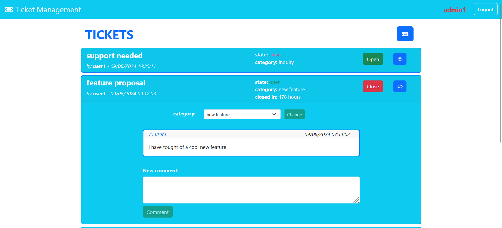
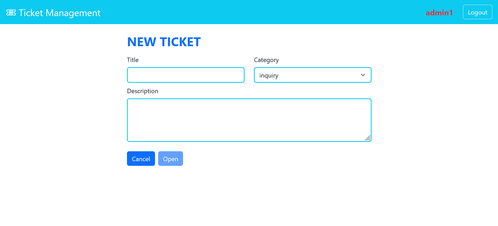

[](https://classroom.github.com/a/Y8bW3OQP)
# Exam #1: "Ticketing system"
## Student: s324165 ERMINI ALESSANDRO 

## React Client Application Routes

- Route `/`: main page, shows the list of all tickes
- Route `/login`: login form; if the authentication is successful the user is redirected to the main page ("/")
- Route `/new`: form for the creation of a new ticket; from here the user can return to the main page ("/") or go to a confirmation page
- Route `/new/confirm`: confirmation page for the creation of a new ticket; from here the user can return to the creation form ("/new")
- Route `*`: PageNotFound; allows to go back to the main page

## API Server

- **GET** `/api/tickets`: get all tickets
  - **response body**: JSON object with the list of tickets or an error message
  ```
    [ { "ticketId": 1, "ownerId": 1, "owner": "user1", "title": "support needed", "state": "closed", "category": "inquiry", "date": "2024-06-09T10:35:11"}, ... ]
  ```
  - **Codes**: `200 OK`, `500 Internal Server Error`
- **POST** `/api/tickets`: create a new ticket for the logged in user
  - **request body**: JSON object representing a ticket
  ```
    {"title": "support needed", "category": "inquiry", "text": "I am in dire need of support, please help"}
  ```
  - **response body**: the ID of the inserted ticket on success or an error message
  - **Codes**: `200 OK`, `422 Unprocessable Entity`, `401 Unauthorized`, `500 Internal Server Error` 
- **PUT** `/api/tickets/:id/close`: closes a ticket owned by the logged in user (or any ticket if admin)
  - **request parameters**: the id of the ticket to close
  - **response body**: number of changes (1) on success or and error message
  - **Codes**: `200 OK`, `401 Unauthorized`, `404 Not Found`, `422 Unprocessable Entity`, `500 Internal Server Error` 
- **PUT** `/api/tickets/:id/open`: allows an admin to reopen a ticket
  - **request parameters**: the id of the ticket to open
  - **response body**: number of changes (1) on success or and error message
  - **Codes**: `200 OK`, `401 Unauthorized`, `404 Not Found`, `422 Unprocessable Entity`, `500 Internal Server Error`
- **PUT** `/api/tickets/:id/category`: allows an admin to change the category of a ticket
  - **request parameters**: the id of the ticket to modify
  - **request body**: JSON object containing the new category
  ```
    {"category": "payment"}
  ```
  - **response body**: number of changes (1) on success or an error message
  - **Codes**: `200 OK`, `401 Unauthorized`, `404 Not Found`, `422 Unprocessable Entity`, `500 Internal Server Error`
- **GET** `/api/tickets/:id/comments`: get all comments to a ticket for an authenticated user
  - **request parameters**: the id of the ticket
  - **response body**: JSON object with the list of comments or an error message
  ```
    [ { "id": 1, "author": "user1", "text": "I am in dire need of support, please help", "timestamp": "2024-06-09T10:35:11"}, ... ]
  ```
  - **Codes**: `200 OK`, `422 Unprocessable Entity`, `500 Internal Server Error`
- **POST** `/api/tickets/:id/comments`: creates a new comment to a ticket for an authenticated user
  - **request parameters**: the ID of the ticket to which the comment should be added to
  - **request body**: JSON object with the text of the comment
  ```
    {"text": "I think i can help you"}
  ```
  - **response body**: the ID of the inserted comment on success or an error message
  - **Codes**: `200 OK`, `400 Bad Request`,`422 Unprocessable Entity`, `401 Unauthorized`, `500 Internal Server Error`
- **GET** `/api/token`: give a token to an authenticated user
  - **response body**: JSON object with the token or an error message
  - **token**: userID with a flag for admin status
  ```
    {"user": 1, "admin": 0}
  ```
  - **Codes**: `200 OK`, `401 Unauthorized`
  

### Authentication API

- **POST** `/api/sessions`: authenticate the user and create a new session
  - **request body**: JSON object with credentials
  ```
    {"user": 1, "admin": 0}
  ```
  - **response body**: JSON object describing the logged user or an error message
  ```
    {"id": 1, "username": "user1", "admin": 0}
  ```
  - **Codes**: `200 OK`, `401 Unauthorized`, `500 Internal Server Error`

- **GET** `/api/sessions/current`: retrieves info on the logged user
  - **response body**: JSON object describing the logged user or an error message
  ```
    {"id": 1, "username": "user1", "admin": 0}
  ```
  - **Codes**: `200 OK`, `401 Unauthorized`, `500 Internal Server Error`

- **DELETE** `/api/sessions/current`: logs out the user
  - **Codes**: `200 OK`, `401 Unauthorized`


## API Server2

- **POST** `/api/estimations`: get the time estimations for a list of tickets (in hours for admins or days for regular users)
  - **response body**: JSON with the list of estimations
  ```
    [ {"id": 1, "estimation": "316 hours"}, ... ]
  ```
  - **Codes**: `200 OK`, `401 Unauthorized`, `422 Uprocessable Entity`

## Database Tables

- Table `users` - (*id*, *name*, *admin*, *hash*, *salt*)\
  **admin**: flag to distinguish admins from regular users
- Table `tickets` - (*id*, *owner*, *title*, *state*, *category*, *timestamp*)\
  **owner**: id of the ticket owner\
  **state**: "open" or "closed"\
  **category**: "inquiry", "maintenance", "new feature", "administrative" or "payment"
- Table `comments` - (*id*, *ticket*, *author*, *text*, *timestamp*)\
  **ticket**: id of the corresponding ticket\
  **author**: id of the comment author\
  **text**: content of the comment

## Main React Components

- `App` (in `App.jsx`): main component; it manages most of the sates and the logic of the application.
- `TicketList` (in `Ticket.jsx`): list of all the tickets.
- `Ticket` (in `Ticket.jsx`): a single ticket, wraps a Bootstrap card.
- `TicketHeader` (in `Ticket.jsx`): the non-expanded ticket, containing information visible to all users and controls to expand and close/open tickets for authenticated users.
- `TicketBody` (in `Ticket.jsx`): the expanded ticket, visible only to logged in users, containing a form to change the ticket category for admins, a list of comments and a box to add a new comment.
- `CommentList` (in `Comment.jsx`): list of all the comments to a ticket.
- `Comment` (in `Comment.jsx`): a wrapper for a Bootstrap card containing the information of a comment: author, timestamp and its text.
- `CommentForm` (in `Comment.jsx`): a form for the insertion of a new comment, inside an expanded ticket.
- `TicketForm` (in `TicketForm.jsx`): a form for the insetion of a new ticket.
- `ConfirmationPage` (in `TicketForm.jsx`): a page containing a read-only ticket summarizing the information inserted in the ticket form. If not confirmed the user will return to the already compiled ticket form.

## Screenshot




## Users Credentials

| username | password | admin |
|----------|----------|------|
| user1 | pwd | no |
| user2 | pwd | no |
| user3 | pwd | no |
| admin1 | pwd | yes |
| admin2 | pwd | yes |

